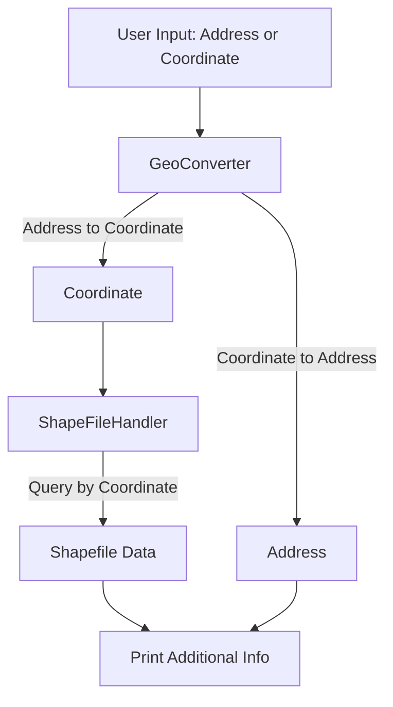

# GeoShapeDemo

A C++ demo project for geocoding and querying additional information from Vietnam Shapefiles using GDAL and nlohmann/json.

## Features
- Convert address to coordinates and vice versa (GeoConverter)
- Load and query multiple Shapefiles for Vietnam region (ShapeFileHandler)
- Print geocoding results and additional info from Shapefiles

## Prerequisites
- C++17 compiler
- CMake >= 3.16
- GDAL development libraries (`libgdal-dev`)
- nlohmann/json (auto-fetched by CMake)

## Setup & Build
1. **Install dependencies:**
   ```bash
   sudo apt-get update
   sudo apt-get install -y build-essential cmake libgdal-dev
   ```
2. **Clone the repository:**
   ```bash
   git clone https://github.com/pvthanh/GeoShapeDemo.git
   cd GeoShapeDemo
   ```
3. **Prepare Shapefiles:**
   - Place Vietnam Shapefiles in `data/gadm41_VNM_shp/` (already included if you cloned the full repo).

4. **Build the project:**
   ```bash
   cmake -S . -B build
   cmake --build build
   ```

## Run
```bash
./build/geocoder_demo
```

## How It Works
1. On startup, the demo loads all `.shp` files in `data/gadm41_VNM_shp/` for Vietnam region boundaries and attributes.
2. It demonstrates geocoding by converting a sample Vietnam address (e.g., "Hanoi, Vietnam") to coordinates and vice versa, showing the results and related Shapefile info.
3. After the initial demo, the program enters interactive mode:
   - You can enter any address (in Vietnam) at the prompt.
   - The program converts the address to coordinates, then queries all loaded Shapefiles for features containing that location.
   - It prints the geocoding result and all additional information found in the Shapefiles (such as administrative boundaries, names, types, etc.).
   - Type `exit` to quit the program.
4. All output supports Unicode, so Vietnamese characters display correctly.

## Diagram


## License
MIT
